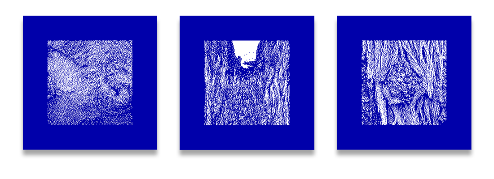

# Exploring Dithering

## Description

This is a repository I worked on to explore image dithering algorithms in processing. I implemented a number of common dithering algorithms, as well as some of my own. I think I've only just scratched the surface, but it's unlikely I'll add to it any time soon. Please feel free to use my code. It's not that efficient and it would need some modification to be used in real time. If you create anything I'd love to see what you come up with. Below I outline each project in more detail.

## Resources
#### Core
*Resources I used extensively throughout the project.*
- DHALF.txt/Dither.txt by Lee Daniel Crocker, Paul Boulay, & Mike Morra
    - [DHALF.txt](http://www.efg2.com/Lab/Library/ImageProcessing/DHALF.TXT)
    - [DHALF.txt](https://github.com/SixLabors/ImageSharp/blob/master/src/ImageSharp/Processing/Processors/Dithering/DHALF.TXT)
    - [Dither.txt](https://github.com/SixLabors/ImageSharp/blob/master/src/ImageSharp/Processing/Processors/Dithering/DITHER.TXT)
- [Coding Train Video by Dan Shiffman](https://thecodingtrain.com/CodingChallenges/090-floyd-steinberg-dithering.html)
- [Wikipedia Article](https://en.wikipedia.org/wiki/Dither)

#### Supplemental
*Resources I skimmed, read every now and then, or discovered while writing this readme.*
- [Libcaca Study: the science behind colour ASCII art](http://caca.zoy.org/study/index.html)
- [Image Dithering: Eleven Algorithms and Source Code by Tanner Helland](http://www.tannerhelland.com/4660/dithering-eleven-algorithms-source-code/)
- [GitHub Dithering Topic](https://github.com/topics/dithering)

#### Inspiration
*Resources I used to draw inspiration from.*
- [Return of the Obra Dinn - Game](https://obradinn.com/)
- [Robert Hodgin - Artist](http://roberthodgin.com/portfolio/stippling/)
